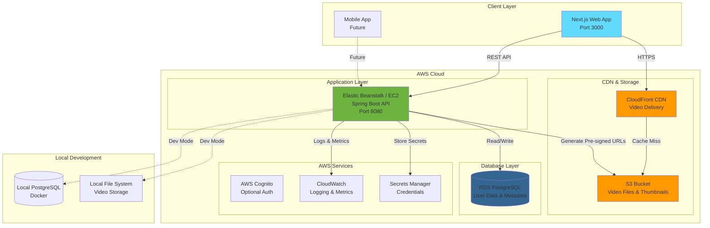
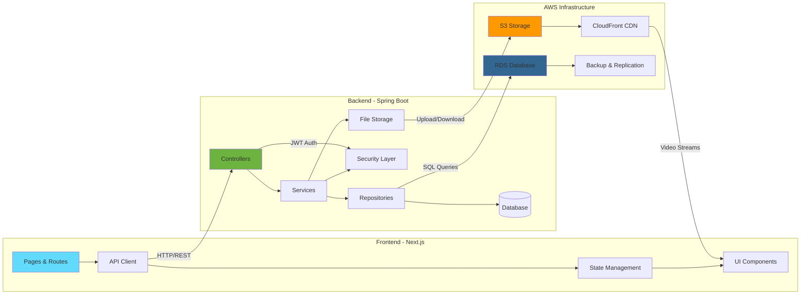
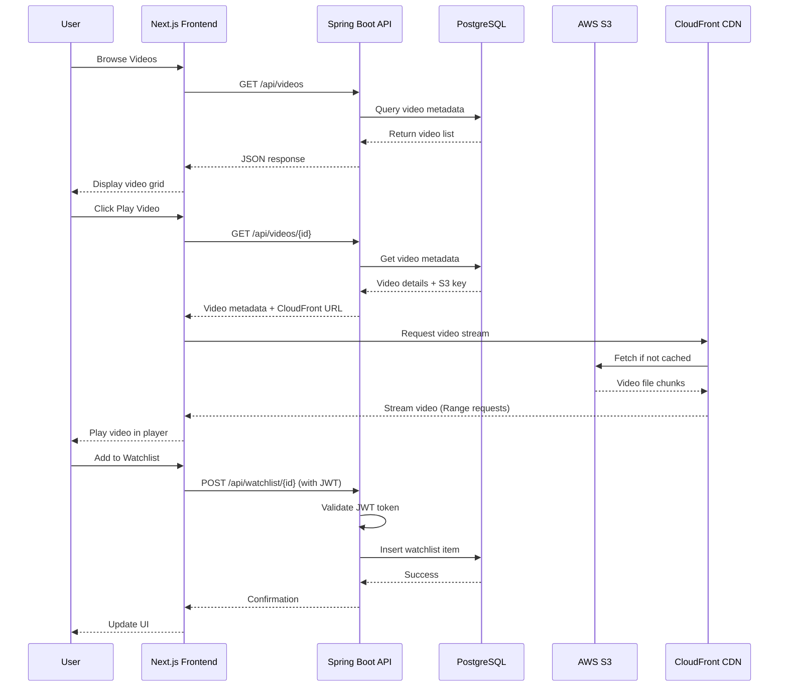

# VOD - Video On Demand Streaming Platform

A DIY Netflix-style video streaming application built to explore modern backend technologies, cloud infrastructure, and full-stack development. This project serves as a learning platform for Spring Boot, Next.js, AWS services, and video streaming architecture.

## 🎯 Project Purpose

This project is designed to:
- **Learn modern backend development** with Spring Boot and Java
- **Explore cloud infrastructure** using AWS services (RDS, S3, CloudFront, EC2/Elastic Beanstalk)
- **Build a production-like video streaming platform** with authentication, user profiles, and video delivery
- **Understand video streaming architecture** including HTTP range requests, CDN distribution, and scalable storage

## ✨ Features

### Core Features (MVP)
- **Video Browsing**
  - Browse videos by category
  - Search functionality
  - Paginated video listings
  - Video details pages with metadata

- **Video Playback**
  - Stream videos with seeking support (HTTP Range requests)
  - Responsive video player
  - Continue watching functionality (tracks last watched position)

- **User Authentication**
  - User registration and login
  - JWT-based authentication
  - Role-based access control (User, Admin)
  - Secure password hashing

- **Personalization**
  - "My List" - save videos to watch later
  - Viewing history and progress tracking
  - User profiles

- **Admin Features**
  - Upload videos with metadata
  - Manage video catalog
  - Admin dashboard

### Technical Features
- RESTful API architecture
- Cloud-native deployment on AWS
- CDN-accelerated video delivery via CloudFront
- Scalable database architecture with PostgreSQL
- Docker containerization
- API security with rate limiting and validation

## 🏗️ Architecture

### System Architecture Diagram



### Component Architecture



### Data Flow - Video Streaming



## 🛠️ Tech Stack

### Frontend
- **Framework**: Next.js 14+ (App Router)
- **Language**: TypeScript
- **Styling**: CSS Modules / Tailwind CSS (optional)
- **State Management**: React Context / Zustand (optional)

### Backend
- **Framework**: Spring Boot 3.x
- **Language**: Java 17+
- **Security**: Spring Security + JWT
- **Database**: PostgreSQL (via Spring Data JPA)
- **Build Tool**: Maven
- **Validation**: Bean Validation

### Infrastructure & DevOps
- **Cloud Provider**: AWS
  - **Compute**: Elastic Beanstalk / EC2
  - **Database**: RDS PostgreSQL
  - **Storage**: S3
  - **CDN**: CloudFront
  - **Monitoring**: CloudWatch
  - **Secrets**: AWS Secrets Manager / SSM Parameter Store
- **Containerization**: Docker
- **Version Control**: Git

### Development Tools
- **IDE**: VS Code / Cursor
- **Database**: Docker (local PostgreSQL)
- **API Testing**: Postman / curl
- **Package Management**: npm / pnpm

## 📁 Project Structure

```
vod/
├── backend/                 # Spring Boot application
│   ├── src/
│   │   ├── main/
│   │   │   ├── java/
│   │   │   │   └── com/vod/
│   │   │   │       ├── controller/    # REST controllers
│   │   │   │       ├── service/       # Business logic
│   │   │   │       ├── repository/    # Data access
│   │   │   │       ├── entity/        # JPA entities
│   │   │   │       ├── dto/           # Data transfer objects
│   │   │   │       ├── security/      # Security config & JWT
│   │   │   │       └── config/        # Configuration classes
│   │   │   └── resources/
│   │   │       └── application.yml    # App configuration
│   │   └── test/                      # Unit & integration tests
│   ├── Dockerfile
│   └── pom.xml                        # Maven dependencies
│
├── frontend/               # Next.js application
│   ├── app/                # App Router pages
│   ├── components/         # React components
│   ├── lib/                # Utilities & API client
│   └── public/             # Static assets
│
├── context/                # Project documentation
│   ├── project_timeline.md
│   └── project_checklist.md
│
└── README.md               # This file
```

## 🚀 Quick Start

### Prerequisites
- Java 17+ JDK
- Maven 3.8+
- Node.js 20+ LTS
- Docker (for local PostgreSQL)
- AWS Account (for cloud deployment)

### Local Development Setup

1. **Start PostgreSQL** (Docker):
   ```bash
   docker run --name vod-postgres \
     -e POSTGRES_PASSWORD=vodpass \
     -e POSTGRES_USER=voduser \
     -e POSTGRES_DB=voddb \
     -p 5432:5432 -d postgres:16
   ```

2. **Backend Setup**:
   ```bash
   cd backend
   ./mvnw spring-boot:run
   ```
   Backend runs on `http://localhost:8080`

3. **Frontend Setup**:
   ```bash
   cd frontend
   npm install
   npm run dev
   ```
   Frontend runs on `http://localhost:3000`

### Detailed Setup Instructions
See `context/project_checklist.md` for a complete step-by-step checklist covering all 4 weeks of development.

## 📚 Learning Resources

### Spring Boot
- [Spring Boot Official Documentation](https://spring.io/projects/spring-boot)
- [Spring Security Reference](https://docs.spring.io/spring-security/reference/)

### Next.js
- [Next.js Documentation](https://nextjs.org/docs)
- [Next.js App Router Guide](https://nextjs.org/docs/app)

### AWS
- [AWS Documentation](https://docs.aws.amazon.com/)
- [AWS Free Tier](https://aws.amazon.com/free/)

### Video Streaming
- [HTTP Range Requests (MDN)](https://developer.mozilla.org/en-US/docs/Web/HTTP/Range_requests)
- [Video Streaming Best Practices](https://www.nginx.com/blog/video-streaming-for-remote-learning-with-nginx/)

## 🗺️ Development Roadmap

This project follows a **4-week structured learning path**:

- **Week 1**: Spring Boot API + Local Video Streaming
- **Week 2**: Next.js Frontend + AWS Basics + First Deployment
- **Week 3**: Cloud-native Storage/Delivery + Better Architecture
- **Week 4**: Hardening, Auth, and Product Features

See `context/project_timeline.md` for detailed weekly breakdowns.

## 🔒 Security Considerations

- **Authentication**: JWT tokens with secure expiration
- **Password Security**: BCrypt hashing
- **API Security**: Rate limiting, input validation
- **AWS Security**: IAM roles, security groups, encrypted storage
- **Secrets Management**: AWS Secrets Manager / SSM Parameter Store
- **HTTPS**: CloudFront SSL/TLS certificates

## 📝 API Endpoints

### Public Endpoints
- `GET /api/videos` - List videos (paginated)
- `GET /api/videos/{id}` - Get video details
- `GET /api/videos/{id}/stream` - Stream video file
- `POST /api/auth/register` - User registration
- `POST /api/auth/login` - User login

### Protected Endpoints (Require JWT)
- `GET /api/watchlist` - Get user's watchlist
- `POST /api/watchlist/{videoId}` - Add to watchlist
- `DELETE /api/watchlist/{videoId}` - Remove from watchlist
- `PUT /api/videos/{id}/progress` - Update viewing progress
- `GET /api/videos/continue-watching` - Get continue watching list

### Admin Endpoints (Require Admin Role)
- `POST /api/admin/videos/presign-upload` - Get pre-signed S3 upload URL
- `POST /api/admin/videos` - Create video metadata
- `GET /api/admin/videos` - List all videos (admin view)
- `DELETE /api/admin/videos/{id}` - Delete video

## 🤝 Contributing

This is a personal learning project. Feel free to fork and adapt for your own learning journey!

## 📄 License

This project is for educational purposes.

---

**Built with ❤️ for learning modern backend development and cloud infrastructure**
# vod
